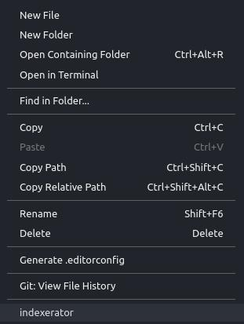

# indexerator 

## Features

vscode index generator
vscode extension that auto generate index.ts/index.js file that export all current folder

```
project
│
└───folder1
│   │   file011.ts
│   │   file012.ts

```

It creates index.ts
```
project
│
└───folder1
│   │   file011.ts
│   │   file012.ts
|   |   index.ts

```

and index.ts will look like:
```javascript
export * from './file011';
export * from './file012';
export * from './file011';

```


Right click on a folder in your project and you'll get the 'indexerator' option




## Known Issues

No bugs, feel free to tell me about bugs.

## Release Notes

First release, any suggestion are welcome.

created by Aviad Hemo.

**Enjoy!**
